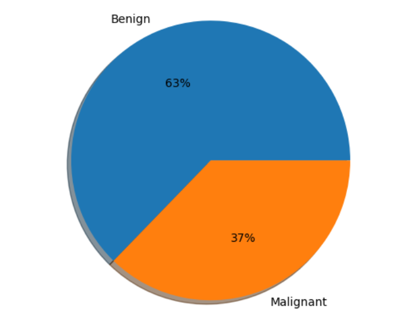
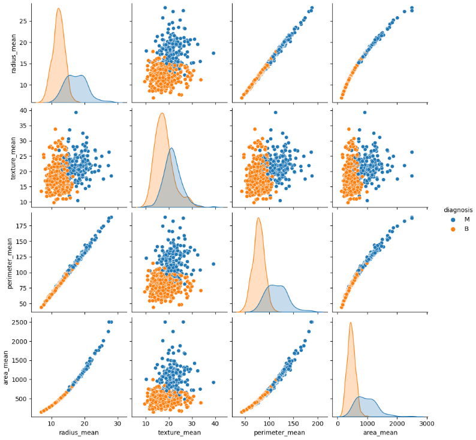
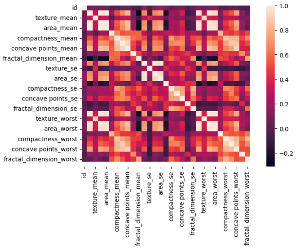
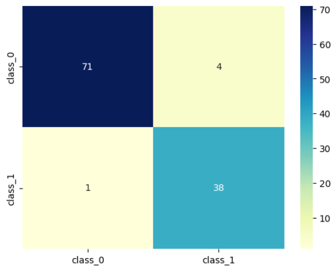
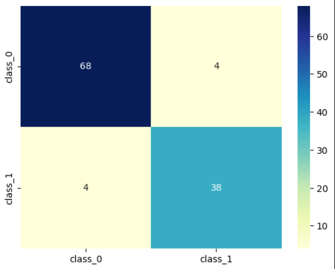
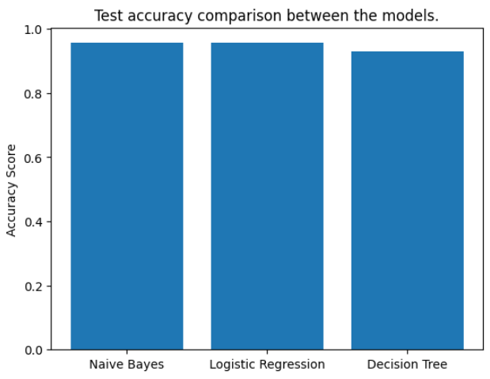

# Breast Cancer Diagnosis using Machine Learning

This project involves analyzing breast cancer data to classify tumors as benign or malignant using various machine learning algorithms including Naive Bayes, Logistic Regression, and Decision Tree classifiers. The dataset is preprocessed, scaled, and split into training and testing sets to evaluate model performance.

## Dataset

The dataset used is the Breast Cancer Wisconsin dataset, consisting of 569 samples with 30 numerical features describing various characteristics of breast tumors. The target variable is `diagnosis`, which indicates whether the tumor is malignant (`M`) or benign (`B`).

Preprocessing steps performed include:  
- Dropping the column `Unnamed: 32` which contained only null values.  
- Encoding the `diagnosis` column to numerical values: malignant as 1 and benign as 0.  
- Applying Min-Max scaling to all feature columns to normalize their ranges.  
- Splitting the dataset into training and testing subsets with an 80-20 ratio, ensuring stratification by the diagnosis label.

## Model Implementation

This project implements three machine learning models to classify breast tumors as malignant or benign:

- **Gaussian Naive Bayes**: A probabilistic classifier based on Bayes’ theorem assuming feature independence.

- **Logistic Regression**: A linear model used for binary classification, trained with a fixed random seed for reproducibility.

- **Decision Tree Classifier**: A tree-based model using entropy as the criterion for splitting and a fixed random seed for consistent results.

Each model was trained on 80% of the dataset (training set) and evaluated on the remaining 20% (test set). Both training and testing accuracies were calculated to measure the models’ performance.

## Results

The performance of the three models on the test set is as follows:

| Model                 | Test Accuracy (%) |
|----------------------|-------------------|
| Gaussian Naive Bayes | 95.61             |
| Logistic Regression  | 95.61             |
| Decision Tree        | 92.98             |

Both **Gaussian Naive Bayes** and **Logistic Regression** achieved the highest test accuracy of approximately 95.6%, while the **Decision Tree** classifier scored slightly lower at 92.98%.

Confusion matrices and classification reports were also generated to provide detailed insights into precision, recall, and F1-scores for each class.

## Visualization

Various visualizations were generated to better understand the dataset and evaluate the models:

- **Pie Chart**: Shows the distribution of benign and malignant tumor classes. 

- **Pairplots**: Illustrate relationships between key tumor features, colored by diagnosis.  
- **Correlation Heatmaps**: Highlight feature correlations within the dataset. 

- **Confusion Matrix Heatmaps**: Visualize prediction performance for each model.
  
   Naive Bayes:  
    
  Logistic Regression:  
    
  Decision Tree:  
  

- **Accuracy Comparison Bar Chart**:  
  

These visualizations provided valuable insights into the data structure and helped assess model effectiveness.

## Dependencies

Make sure you have the following Python libraries installed before running the code:

- `numpy`
- `pandas`
- `matplotlib`
- `seaborn`
- `scikit-learn`

You can install them using the following command:

```bash
pip install numpy pandas matplotlib seaborn scikit-learn
```

## How to Run the Code

1. **Clone** this repository to your local machine.

2. Ensure you have **Python 3.6 or above** installed.

3. **Install dependencies** as listed above.

4. Place the dataset CSV file (`data.csv`) in the specified directory.

5. **Run the Jupyter Notebook** step by step to preprocess the data, train models, and evaluate results.

6. Visualizations and evaluation metrics will be **generated automatically**.

   
## Conclusion

This project demonstrated the use of machine learning algorithms to classify breast tumors as malignant or benign based on various tumor characteristics. Both **Gaussian Naive Bayes** and **Logistic Regression** models achieved strong accuracy (~95.6%), while the **Decision Tree** classifier performed slightly lower (~93%).

Future work could include exploring more advanced models, hyperparameter tuning, and incorporating additional data preprocessing techniques to further improve classification performance.
